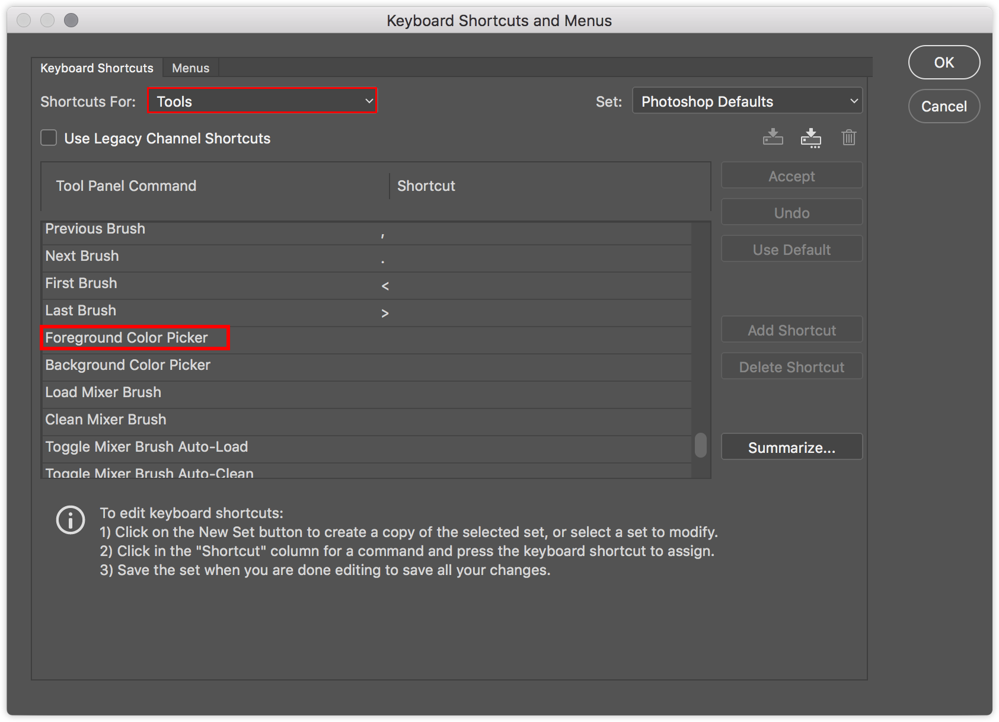

# လိုအပ်ချက်

ပထမဆုံး လိုအပ်တာ က Auto Hot Key [ဒီမှာဒေါင်းပါ](https://www.autohotkey.com/) current version ကိုဒေါင်းပါ  
install လုပ်ပါ  
ပြီးရင် [ဒီ shotcut script](https://github.com/yoshiro456/my-photoshop-ahk/blob/main/shotcut.ahk) ကို သွားပါ ညာဖက်ဒေါင့်မာရှိတဲ့ `Raw`နိုပ်ပါ `Save as` ပြီးရင် double click နိုပ်လိုက်ပြီး Run ရင်ရပါပြီ

Shortcut ပြောင်းချင်ရင် `shotcut.ahk` ကို Notepad နဲ့ ဖွင့်ပြီး  
ပြောင်းချင်တဲ့ Shotcut ဥပမာ `x::[` ထဲက `::` ကိုချန်ထားပါ `x` ကို ဖျက်ပြီးတခြားဟာပြောင်လို့ရပါပြီ

# Config Photoshop
## 1. Color Picker Shotcut  
ဒီshotcut သုံးဖို့ Photoshop ရဲ့ original shotcut ပြောင်းဖို့လိုပါတယ်
`Ctrl+Alt+Shift+K`တွဲနိုပ်ပါ ဒီလိုပေါ်လာပါမယ်
  
`Forgeground Color Picker` ကို `n` ပေးလိုက်ပါ OK သုံးလို့ရပါပြီ
## 2. Flip Horizontal Canvas
ဒီshotcut သုံးဖို့ Photoshop ရဲ့ original shotcut ပြောင်းဖို့လိုပါတယ်
[Youtube](https://www.youtube.com/watch?v=HJDgXd6IDZE) မှာ ပြောင်းဖို့ကြည့်ပါ

# အသုံးပြုနည်း

`` ` `` - Shotcut ကို ပိတ်ဖွင့်လုပ်  
`z` - Undo ကို ctrl နိုပ်စရာမလို  
`x` - Brush size ကို သေးအောင်လုပ်  
`c` - Brush size ကြီးအောင်လုပ်  
`a` - Layer အသစ်လုပ်  
`d` - Layer ဖျက်  
`w` - Layer အပေါ်တခုသွား  
`s` - Layer အောက်တခုသွား  
`t` - Color Picker ဒီ shotcut သုံးဖို့ရာ photoshop setting ပြောင်းဖို့လိုပါတယ် [ဒီမှာ](#1-color-picker) ကြည့်ပါ  
`v` - Canvas ကိုမှန်တချပ်လို ပြောင်းဖို့ photoshop setting ကို ပြောင်းဖို့လိုပါတယ် [ဒီမှာ](#2-config-photoshop) ကြည့်ပါ
